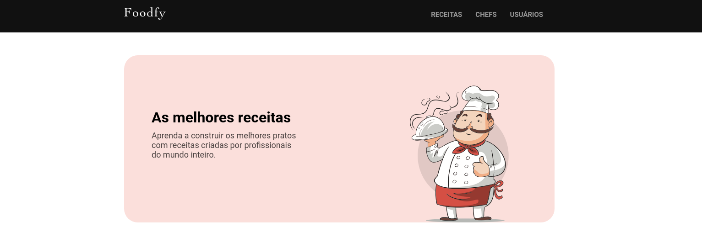

# Foodfy - Desafio do curso LaunchBase

Essa é uma solução do desafio proposto no curso LaunchBase da Rocketseat. O desafio consiste no desenvolvimento de uma aplicação para gerenciamento de receitas e chefs.

### O desafio

Usuários são capazes de:

- Admin e Usuário: login e logout
- Admin: Cadastrar novos usuários
- Admin: Gerenciar usuários, chefs e receitas
- Usuário: Editar seus dados de acesso e perfil
- Usuário: Gerenciar suas próprias receitas

### Tecnologias utilizadas

- HTML5
- CSS
- JavaScript
- NodeJs
- Postgrees

Made with :heart: by [Yasmin Braga](https://github.com/yasminbraga)
